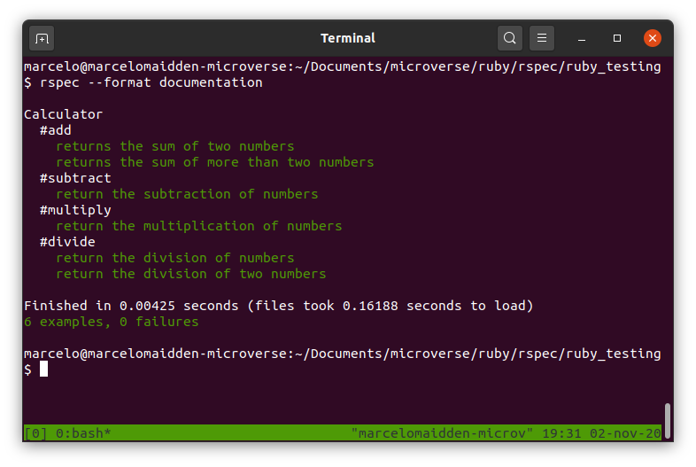

# Ruby Rspec tests

# A project made to test Rspec framework in ruby to make TDD

## Built With

- Ruby
- Rspec

## Getting started
In order to run the project locally clone the repository 

    git clone https://github.com/marcelomaidden/ruby_testing
    
Enter the directory

    cd ruby_testing

Install gem package

    gem install rspec

Run tests and see the results

    rspec --profile --format documentation

## Live Demo

[Live Demo Link](https://repl.it/repls/AwesomeKlutzySites#README.md)

## Author

**Marcelo Araújo**

- GitHub: [@marcelomaidden](https://github.com/marcelomaidden)
- Twitter: [@marcelomaidden](https://twitter.com/marcelomaidden)
- LinkedIn: [Marcelo Fernandes de Araújo](https://www.linkedin.com/in/marcelo-fernandes-de-ara%C3%BAjo-56700a171/)

## Acknowledgements
- Ruby creators
- Rspec creators

##  Contributing

Contributions, issues, and feature requests are welcome!

## Show your support

Give a ⭐️ if you like this project!

## License

This project is [MIT](./LICENSE) licensed.
